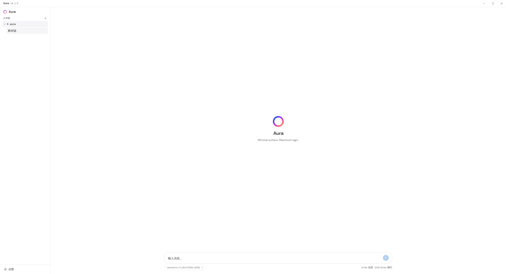
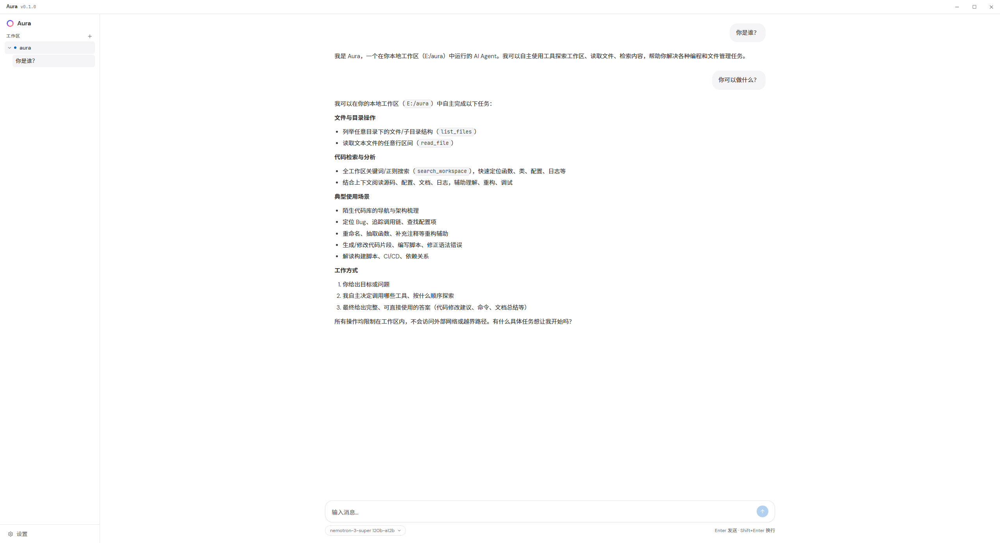
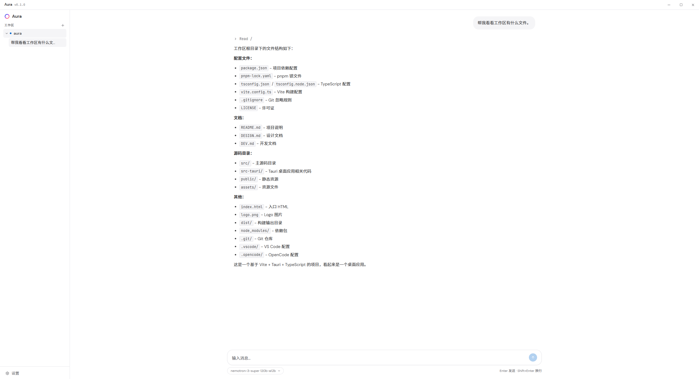
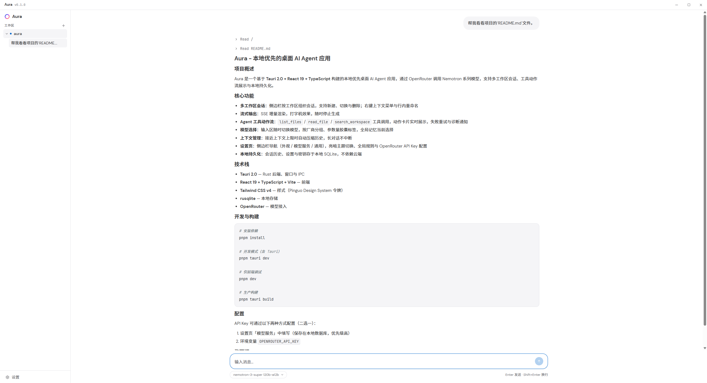

<p align="center">
  
</p>

<h1 align="center">Aura</h1>

<p align="center">
  
  
  
  
</p>

本地优先的桌面 AI Agent 应用，基于 Tauri 2.0 + React 19 + TypeScript 构建。通过 OpenRouter 调用 Nemotron 系列模型，支持多工作区会话、工具动作流展示与本地持久化。

## 功能

- **多工作区会话**：侧边栏按工作区组织会话，支持新建、切换与删除；右键上下文菜单与行内重命名（操作不触碰磁盘文件）
- **流式输出**：SSE 增量渲染，打字机效果，随时停止生成
- **Agent 工具动作流**：`list_files` / `read_file` / `search_workspace` 工具调用，动作卡片实时展示，失败重试与诊断通知
- **模型选择**：输入区随时切换模型，按厂商分组、参数量胶囊标签，全局记忆当前选择
- **上下文管理**：接近上下文上限时自动压缩历史，长对话不中断
- **设置页**：侧边栏导航（外观 / 模型服务 / 通用），亮暗主题切换、全局规则与 OpenRouter API Key 配置
- **本地持久化**：会话历史、设置与密钥存于本地 SQLite，不依赖云端

## 截图

### 欢迎页



### 基础对话



### 工具调用





## 开发

```bash
pnpm install
pnpm tauri dev
```

前端单独调试：

```bash
pnpm dev
```

## 构建

```bash
pnpm tauri build
```

## 配置

API Key 二选一：

- 设置页「模型服务」中填写（保存在本地数据库，优先级高）
- 环境变量 `OPENROUTER_API_KEY`

## 技术栈

- [Tauri 2.0](https://tauri.app) — Rust 后端、窗口与 IPC
- React 19 + TypeScript + Vite — 前端
- Tailwind CSS v4 — 样式（Pinguo Design System 令牌）
- rusqlite — 本地存储
- OpenRouter — 模型接入

## 许可证

本项目基于 [Apache License 2.0](LICENSE) 开源。
